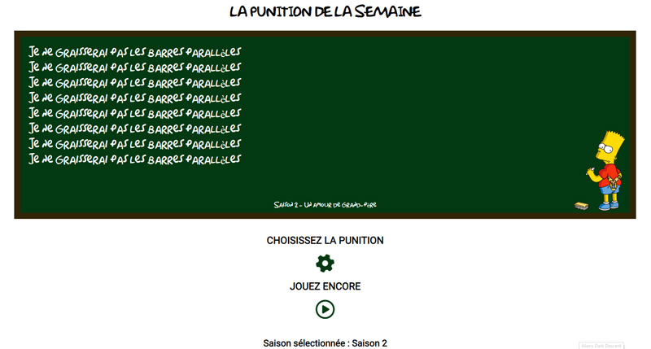
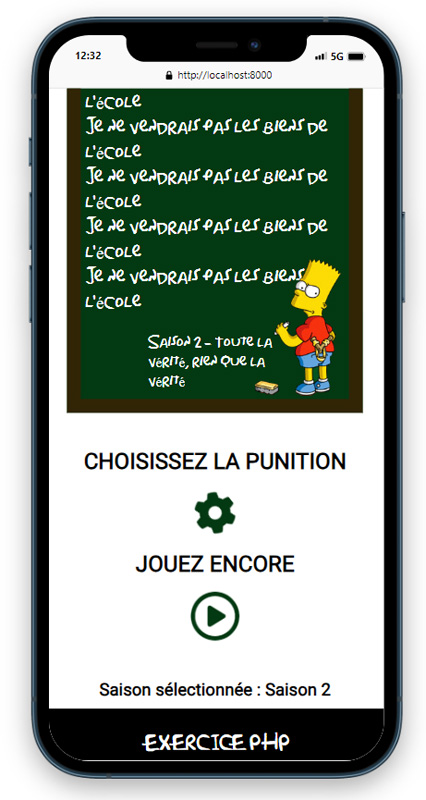
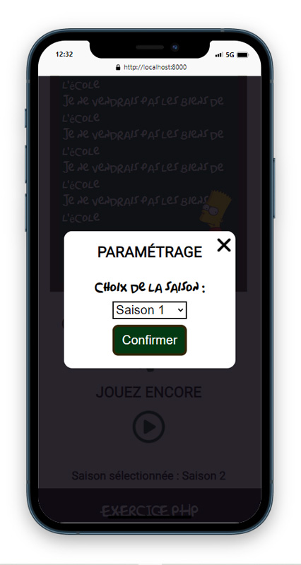

# Bart-Simpson
À chaque nouvel épisode de la série, Bart rédig eune punition au tableau.  
Cette situation nous servira de contexte à la mise en place d'un petit exercice combiant PHP et JavaScript.
## Objectifs :
:heavy_check_mark: Lire un fichier Json et exploiter son contenu en PHP.  
:heavy_check_mark: Utiliser les variables de session.  
:heavy_check_mark: Gérer un formulaire avec la méthode Post.  
:heavy_check_mark: Créer et appeler des fonctions en PHP et HTML.   
:heavy_check_mark: Générer et lire un cookie. 
### Version 1 :
Une punition extraite aléatoirement depuis le fichier Json doit être affichée dans le tableau.  
Cette dernière devra être écrite plusieurs fois (entre 5 et 10) avec un intervalle de temps défini  
Une modale proposera à l'utilisateur de choisir à partir de quelle saison extraire la punition à afficher.  
Cette information devra être conservée en session.
## Screenshots :
Vue Desktop :  
  
Vue Mobile :  
  
Modale :  
  
